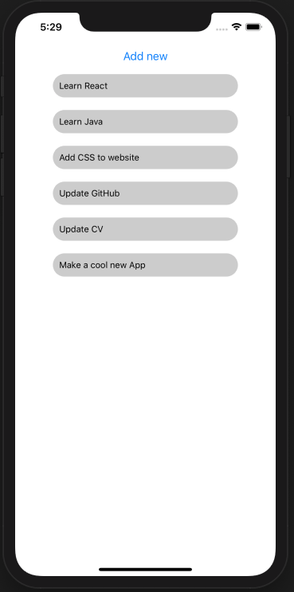
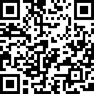

# React Native Goal Tracker

## My First React Native Application
Add your goal to the list and tap it away once your done, it's simple as that! I created this project as a means to learn React Native basics,  however, here it is. If you're after a simplistic, easy to navigate application to jot down your goals with ease you've found it!

I made this app with the knowledge I obtained from the course [React Native - The Practical Guide - 2020 Edition](https://www.udemy.com/course/react-native-the-practical-guide/)

 
   
  

  

## How To Run The App
By far the easiest way to try out this app is by installing the Expo app and scanning the QR code provided.

[IOS](https://itunes.apple.com/app/apple-store/id982107779)

[Android](https://play.google.com/store/apps/details?id=host.exp.exponent&referrer=www)

[Find the app on expo](https://expo.io/@steven-klavins/react-native-goal-tracker)

I can export an APK if requested... 

  
  
  
